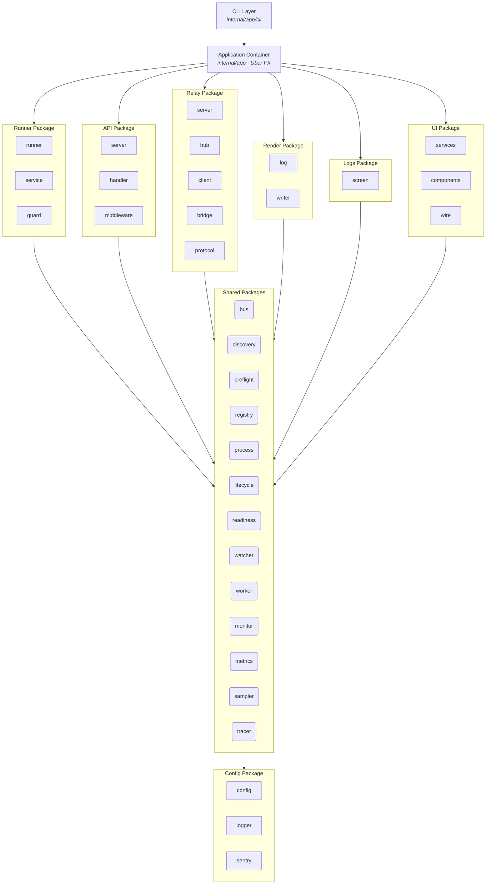
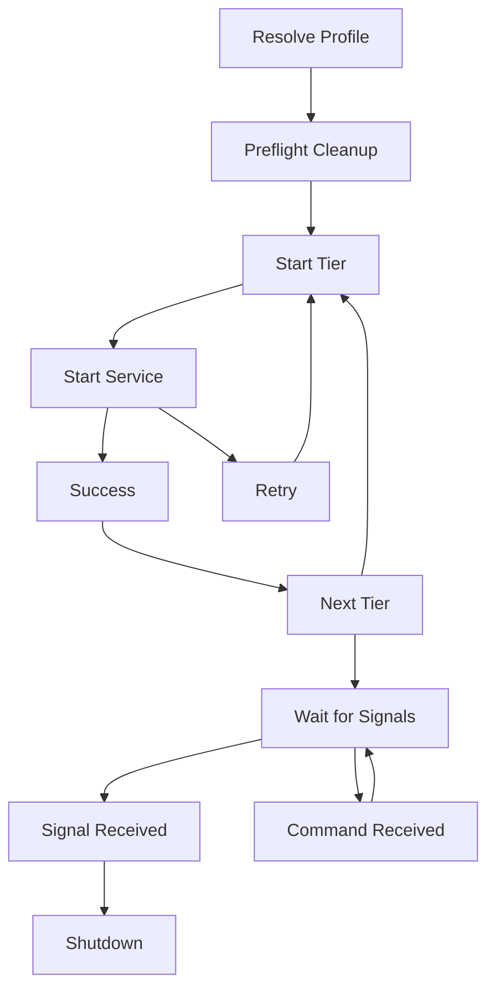
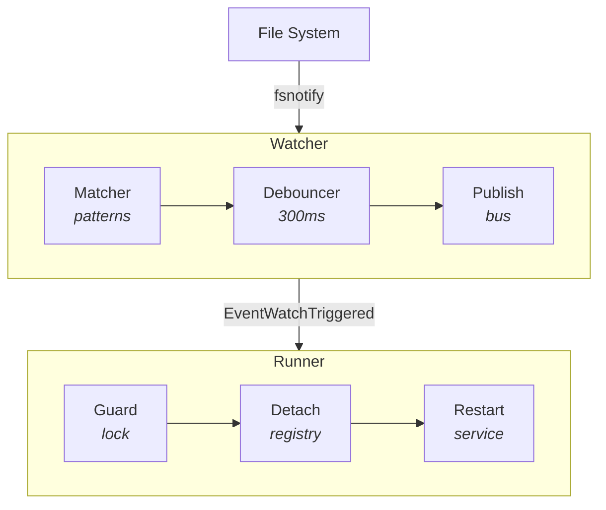
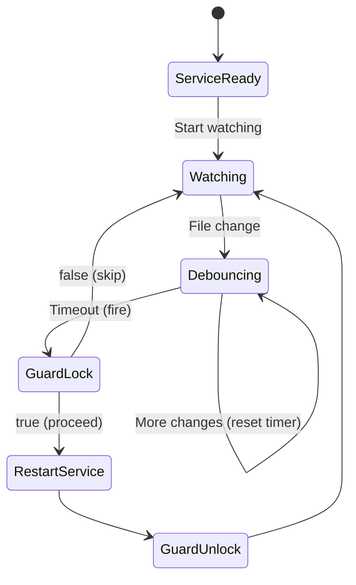
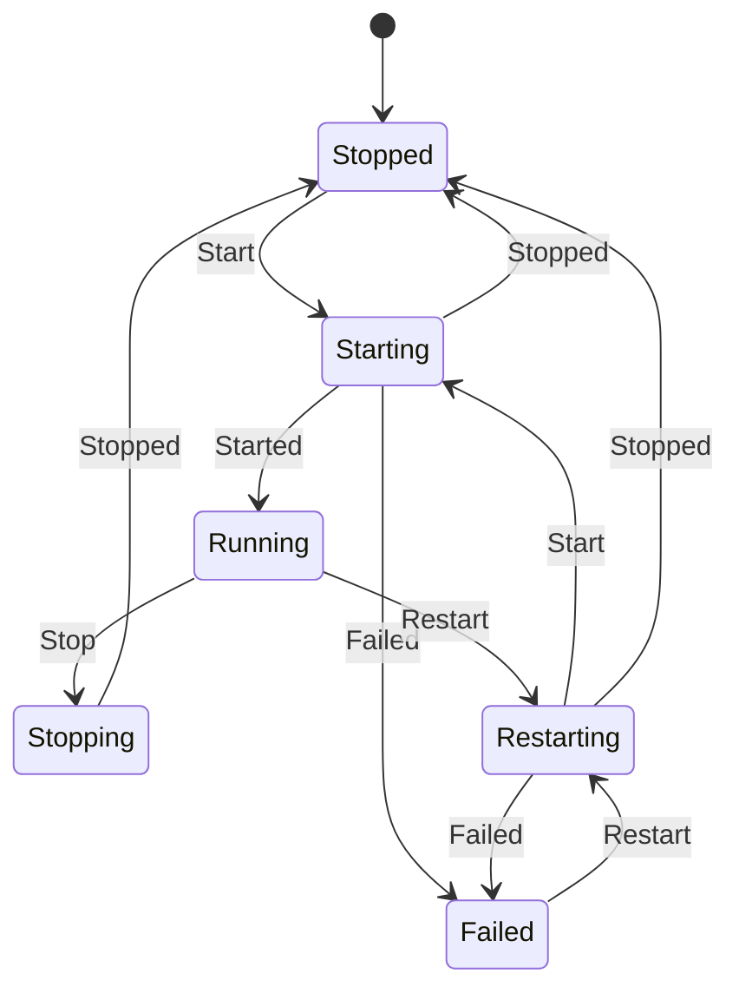
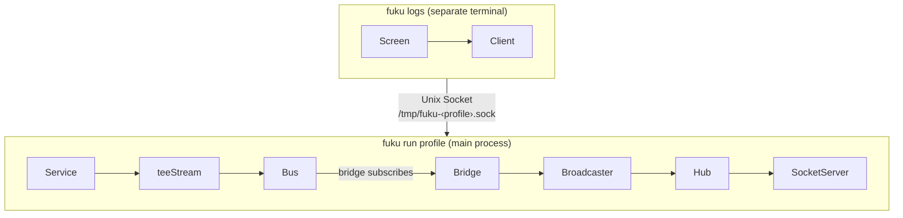
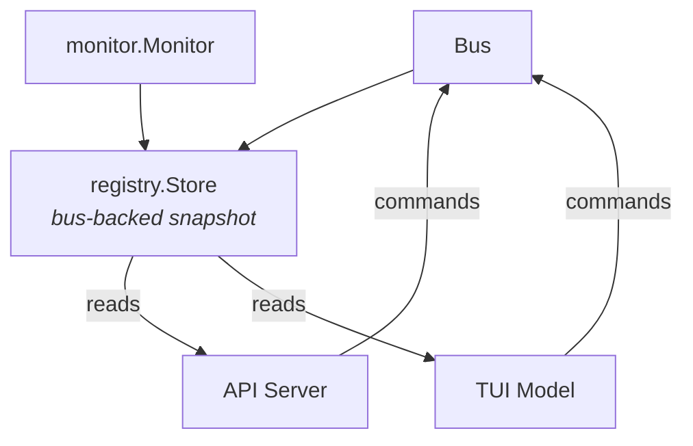
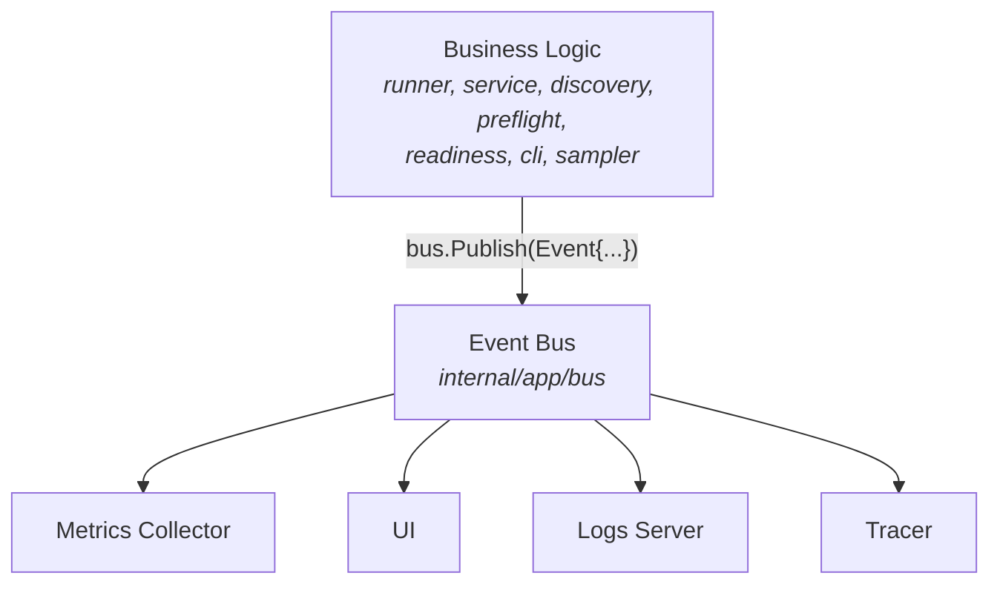

# Architecture

This document describes the core architectural patterns used in fuku's service orchestration system.

## Overview

Fuku uses a layered architecture with three distinct patterns:

1. **Data/Communication Layer** - Pure data structures and pub/sub messaging
2. **Event-Driven Orchestration** - Process lifecycle management via events
3. **FSM-Based UI State** - Finite state machines for UI representation



## 1. Data/Communication Layer

**Package**: `internal/app/bus`

The bus package provides a unified pub/sub messaging system for events and commands. It has no business logic and serves as the foundation for inter-component messaging.

### Bus Interface

```go
type Bus interface {
    Subscribe(ctx context.Context) <-chan Message
    Publish(msg Message)
    Close()
}
```

The Bus implements a unified pub/sub pattern for both events and commands:

- **Non-blocking publish**: Messages are sent to subscriber channels without blocking
- **Critical messages**: Important messages (phase changes) block until delivered
- **Context-aware cleanup**: Subscribers auto-unsubscribe when context cancels
- **Buffered channels**: Prevents slow subscribers from blocking publishers
- **Log broadcasting**: Server is injected at construction time via FX dependency injection

### Message Types

Events:
```
EventCommandStarted    → CLI command execution started
EventProfileResolved   → Profile and tier structure resolved
EventPhaseChanged      → Application phase transition
EventTierStarting      → Tier startup begins
EventTierReady         → All services in tier are ready
EventServiceStarting   → Service process started
EventReadinessComplete → Readiness check completed for a service
EventServiceReady      → Service passed readiness check
EventServiceFailed     → Service failed to start/run
EventServiceStopping   → Service shutdown initiated
EventServiceStopped    → Service process terminated
EventServiceRestarting → Service restart initiated
EventPreflightStarted  → Preflight process scan begins
EventPreflightKill     → Orphaned process being killed
EventPreflightComplete → Preflight cleanup finished
EventSignal            → OS signal received (SIGINT/SIGTERM)
EventWatchTriggered    → File change detected for hot-reload
EventWatchStarted      → File watcher started for a service
EventWatchStopped      → File watcher stopped for a service
EventResourceSample    → Periodic CPU/memory sample for fuku process
EventAPIStarted        → API server bound and accepting requests
EventAPIStopped        → API server shut down
```

Commands:
```
CommandStartService   → Start stopped/failed service
CommandStopService    → Stop individual service
CommandRestartService → Restart individual service
CommandStopAll        → Graceful shutdown trigger
```

### Phases

```
PhaseStartup  → Services starting in tier order
PhaseRunning  → All services ready, accepting commands
PhaseStopping → Shutdown in progress
PhaseStopped  → All services terminated
```

### Design Principles

1. **No business logic** - Only data structures and channel management
2. **Type-safe events** - Strongly typed event data via interfaces
3. **Graceful degradation** - NoOp implementations for non-UI mode
4. **Thread-safe** - All operations protected by mutexes

## 2. Event-Driven Orchestration

**Package**: `internal/app/runner`

The runner package manages actual OS processes using event-driven patterns rather than state machines.

### Why Event-Driven?

1. **External state source**: OS manages process lifecycle, runner reacts to it
2. **Async by nature**: Process I/O, signals, and readiness are inherently async
3. **Flexible retry logic**: Exponential backoff doesn't fit FSM patterns
4. **Observable**: Events provide audit trail of what happened

### Process Lifecycle



### Service Orchestration

```go
func (r *runner) Run(ctx context.Context, profile string) error {
    startupStart := time.Now()

    // 1. Publish startup phase
    r.bus.Publish(Message{Type: EventPhaseChanged, Data: PhaseChanged{Phase: PhaseStartup}})

    // 2. Resolve profile into tier structure (timed)
    discoveryStart := time.Now()
    tiers, _ := r.discovery.Resolve(profile)
    r.bus.Publish(Message{Type: EventProfileResolved, Data: ProfileResolved{
        Tiers: tiers, Duration: time.Since(discoveryStart),
    }})

    // 3. Preflight cleanup — kill orphaned processes in service directories
    dirs := r.resolveServiceDirs(services)
    r.preflight.Cleanup(ctx, dirs)

    // 4. Start tiers sequentially (each tier timed)
    for _, tier := range tiers {
        tierStart := time.Now()
        r.bus.Publish(Message{Type: EventTierStarting})
        r.startTier(ctx, tier)
        r.bus.Publish(Message{Type: EventTierReady, Data: TierReady{
            Name: tier.Name, Duration: time.Since(tierStart), ServiceCount: len(tier.Services),
        }})
    }

    // 5. Transition to running phase (with total startup duration)
    r.bus.Publish(Message{Type: EventPhaseChanged, Data: PhaseChanged{
        Phase: PhaseRunning, Duration: time.Since(startupStart), ServiceCount: len(services),
    }})

    // 6. Wait for signals or commands (including watch events for hot-reload)
    for {
        select {
        case sig := <-sigChan:
            // Handle OS signal
        case msg := <-msgChan:
            // Handle command or watch event
        }
    }

    // 7. Graceful shutdown (timed)
    r.bus.Publish(Message{Type: EventPhaseChanged, Data: PhaseChanged{Phase: PhaseStopping}})
    shutdownStart := time.Now()
    serviceCount := r.shutdown()
    r.bus.Publish(Message{Type: EventPhaseChanged, Data: PhaseChanged{
        Phase: PhaseStopped, Duration: time.Since(shutdownStart), ServiceCount: serviceCount,
    }})
}
```

### Key Patterns

1. **Registry** (`internal/app/registry`): Single source of truth for tracking running processes
   - Maintains process lifecycle with WaitGroup synchronization
   - Tracks insertion order for deterministic reverse-order shutdown
   - Supports process detachment for restart scenarios
   - Ensures WaitGroup only decrements when processes actually exit
2. **Guard** (`internal/app/runner/guard`): Prevents concurrent restarts of the same service
   - Essential for hot-reload correctness when multiple file changes occur rapidly
3. **Worker Pool** (`internal/app/worker`): Shared bounded pool for concurrent task execution
   - Semaphore-based with configurable max workers from `config.Concurrency.Workers`
   - Used by both runner (tier starts) and preflight (process kills)
4. **Preflight Cleanup** (`internal/app/preflight`): Kills orphaned processes before startup
   - Scans running processes and matches working directories to service directories
   - Concurrent kills bounded by worker pool, context-cancellable
   - SIGTERM with 2s grace period before SIGKILL escalation
5. **Retry with Backoff**: Automatic retry on transient failures
6. **Graceful Shutdown**: SIGTERM → wait → SIGKILL

### Hot-Reload Lifecycle

**Package**: `internal/app/watcher`

The watcher package monitors file changes and triggers service restarts with debouncing to prevent restart storms.
It uses a directory registry to track which services watch each directory, enabling correct handling of shared paths where multiple services watch the same directories.



### Watcher State Flow



### Debouncer Pattern

The debouncer prevents restart storms when editors save multiple files or trigger multiple write events:

```go
type Debouncer interface {
    Trigger(service string, files []string)
    Stop()
}
```

**Key behaviors**:
- Collects file changes within a 300ms window
- Resets timer on each new change (sliding window)
- Fires once with accumulated file list
- Per-service debouncing (service A changes don't affect service B timer)

### Guard Pattern

The guard prevents concurrent restarts of the same service:

```go
type Guard interface {
    Lock(name string) bool   // Returns true if lock acquired
    Unlock(name string)
    IsLocked(name string) bool
}
```

**Why needed**:
- Multiple file changes can trigger multiple watch events
- Without guard: goroutine 1 stops service-a, goroutine 2 stops service-a → race condition
- With guard: goroutine 1 acquires lock, goroutine 2 skips (service already restarting)

### Registry Pattern

The Registry provides centralized process lifecycle management with proper synchronization:

```go
type Lookup struct {
    Proc     Process
    Exists   bool
    Detached bool
}

type Registry interface {
    Add(name string, proc Process, tier string)
    Get(name string) Lookup
    SnapshotReverse() []Process
    Detach(name string)
    Wait()
}
```

**Key behaviors**:

1. **Add**: Registers process, increments WaitGroup, spawns goroutine to wait for exit
2. **Get**: Returns Lookup struct containing process, existence status, and detachment status
3. **Detach**: Removes from active map and marks as detached (for restart scenarios)
4. **Wait**: Blocks until all processes have actually exited, with configurable timeout to prevent infinite hangs
5. **SnapshotReverse**: Returns ALL processes (including detached) in reverse startup order for graceful shutdown

**Critical semantics**:
- WaitGroup only decrements when process **actually exits** (Done() channel closes)
- Detach() does NOT decrement WaitGroup immediately
- SnapshotReverse() includes BOTH active and detached processes to ensure shutdown can signal all processes
- This ensures `Wait()` doesn't return while detached processes are still running
- Prevents leftover PIDs and shutdown deadlocks

**Restart flow**:
```go
// 1. Detach old process (remove from map, mark as detached)
registry.Detach(serviceName)

// 2. Stop old process
service.Stop(oldProc)

// 3. Start new process
newProc := service.Start(ctx, serviceName, config)

// 4. Add new process to registry
registry.Add(serviceName, newProc, tier)

// 5. Old process exits → Done() fires → WaitGroup decremented
// 6. New process tracked independently
```

### Context Management

The CLI creates a single cancellable context that coordinates both the runner and UI lifecycles. The UI program is created first to avoid a race condition, then the runner starts in a background goroutine:

```go
func (c *cli) runWithUI(ctx context.Context, profile string) (int, error) {
    ctx, cancel := context.WithCancel(ctx)
    defer cancel()

    // UI program is created first to ensure it's ready before runner starts
    program, err := c.ui(ctx, profile)
    if err != nil {
        return 1, err
    }

    // Runner runs in background goroutine
    go func() {
        runnerErrChan <- c.runner.Run(ctx, profile)
    }()

    // UI runs in foreground, blocks until user quits
    if _, err := program.Run(); err != nil {
        cancel()
        <-runnerErrChan
        return 1, err
    }

    // When UI exits, cancel context to stop runner
    cancel()

    // Wait for runner to finish
    err = <-runnerErrChan
}
```

**Key benefits**:
1. **Single source of truth**: One context controls entire application lifecycle
2. **Clean shutdown**: UI exit triggers context cancellation, runner responds gracefully
3. **Testability**: Tests can pass their own contexts for lifecycle control

**Critical events**: Lifecycle state changes are marked as `Critical: true` to guarantee delivery even when event buffers are full, preventing UI state desynchronization.

### Command Handling

Commands are processed in both startup and running phases:

```go
switch cmd.Type {
case CommandStopService:
    r.service.Stop(data.Name)

case CommandStartService:
    go r.runWithWorker(ctx, data.Name, r.service.Resume)

case CommandRestartService:
    go r.runWithWorker(ctx, data.Name, r.service.Restart)

case CommandStopAll:
    return true  // Exit run loop, trigger shutdown
}
```

**Worker pool throttling**: Start and restart commands go through `runWithWorker()` which calls `worker.Acquire/Release`, respecting the configured `concurrency.workers` limit. This prevents API or TUI clients from overwhelming the host by starting many services simultaneously.

**Startup phase handling**: Commands (restart/stop individual services) are processed during startup to handle user interactions before all services are ready. StopAll command aborts the entire startup sequence.

## 3. FSM-Based UI State

**Package**: `internal/app/ui/services`

The UI uses finite state machines to manage visual representation of service states.

### Why FSM for UI?

1. **Predictable transitions**: Users expect consistent state progression
2. **Valid states only**: Prevent displaying invalid combinations
3. **Operation tracking**: Know what operations are in progress
4. **Loader management**: Associate spinners with specific transitions

### Service State Machine



### State Definitions

**Package**: `internal/app/registry` (shared by runner, API, and UI)

```go
type Status string

const (
    StatusStarting   Status = "starting"   // Process started, waiting for readiness
    StatusRunning    Status = "running"    // Service ready and operational
    StatusStopping   Status = "stopping"   // Shutdown in progress
    StatusRestarting Status = "restarting" // Restart initiated
    StatusStopped    Status = "stopped"    // Service not running
    StatusFailed     Status = "failed"     // Service failed
)

// Helper methods on Status type
func (s Status) IsRunning() bool     // running
func (s Status) IsStartable() bool   // stopped or failed
func (s Status) IsStoppable() bool   // running
func (s Status) IsRestartable() bool // running, failed, or stopped
```

### FSM Transitions

```go
fsm.Events{
    {Name: Start,   Src: []string{Stopped, Restarting}, Dst: Starting},
    {Name: Stop,    Src: []string{Running},             Dst: Stopping},
    {Name: Restart, Src: []string{Running, Failed, Stopped}, Dst: Restarting},
    {Name: Started, Src: []string{Starting},            Dst: Running},
    {Name: Stopped, Src: []string{Stopping, Restarting}, Dst: Stopped},
    {Name: Failed,  Src: []string{Starting, Running, Restarting}, Dst: Failed},
}
```

### FSM Callbacks

Callbacks execute side effects on state transitions:

```go
fsm.Callbacks{
    OnStarting: func(ctx, e) {
        service.MarkStarting()
        if !loader.Has(service) {           // Don't overwrite "Restarting..."
            loader.Start("Starting...")
        }
    },
    OnStopping: func(ctx, e) {
        service.MarkStopping()
        loader.Start("Stopping...")
        bus.Publish(Message{Type: CommandStopService, Data: Payload{Name: service}})
    },
    OnRestarting: func(ctx, e) {
        loader.Start("Restarting...")
        bus.Publish(Message{Type: CommandRestartService, Data: Payload{Name: service}})
    },
    OnRunning: func(ctx, e) {
        service.MarkRunning()
    },
    OnStopped: func(ctx, e) {
        service.MarkStopped()  // Clears PID
    },
    OnFailed: func(ctx, e) {
        service.MarkFailed()
    },
}
```

### Event → FSM Synchronization

The UI subscribes to the Bus and updates FSM accordingly:

```go
func (m Model) handleServiceReady(event Event) Model {
    data := event.Data.(ServiceReadyData)
    if service := m.services[data.Service]; service != nil {
        m.loader.Stop(data.Service)           // Remove spinner
        service.FSM.Event(ctx, Started)       // Transition FSM
        // FSM callback updates service.Status
    }
    return m
}
```

### Loader Queue (FIFO)

Operations are tracked in a first-in-first-out queue:

```go
type Loader struct {
    Model  spinner.Model
    Active bool
    queue  []LoaderItem  // FIFO queue
}

func (l *Loader) Start(service, msg string)  // Add/update operation
func (l *Loader) Stop(service string)        // Remove operation
func (l *Loader) Message() string            // Get front of queue
```

This provides:
- Predictable message ordering
- Multiple concurrent operations
- Visual feedback for each operation

## 4. Log Streaming

**Packages**: `internal/app/relay`, `internal/app/render`, `internal/app/logs`

Log streaming is split into three packages: **relay** handles Unix socket transport with history replay, **render** handles log presentation and formatting, and **logs** provides the `fuku logs` CLI screen.

### Architecture



### Components

**relay** — Unix socket transport and broadcasting:
1. **Server** - Unix socket server that accepts client connections
2. **Hub** - Connection hub for broadcasting log messages to subscribers
3. **Client** - Connects to running instance and streams logs
4. **Bridge** - Subscribes to bus events and forwards them to the relay broadcaster
5. **Protocol** - JSON wire format for messages between server and client

**render** — Log presentation:
1. **Log** - Formats service log lines with colors and renders banners
2. **Writer** - Application logger output writer

**logs** — CLI command:
1. **Screen** - The `fuku logs` command handler that connects to a running instance via relay client

### Protocol

JSON lines over Unix socket:

```json
// Client → Server (subscribe)
{"type":"subscribe","services":["api","db"]}

// Server → Client (status - sent after subscribe)
{"type":"status","version":"0.18.0","profile":"default","services":["api","db","web"]}

// Server → Client (log message)
{"type":"log","service":"api","message":"Server started on :8080"}
```

## 5. Runtime State Store & REST API

**Packages**: `internal/app/registry` (store), `internal/app/api`

The runtime state store subscribes to bus events and maintains a consistent snapshot of all service states for read-only consumers (API and TUI).

### Architecture



### Store Design

The store maintains per-service state from bus lifecycle events:

- **Status** — `registry.Status` type with typed constants
- **PID, CPU, Memory** — sampled on a fixed interval with PID recheck to prevent stale stats after restarts
- **StartTime** — recorded from `msg.Timestamp` (publish time, not dequeue time) for accurate uptime
- **Instance uptime** — starts from `PhaseStartup`, includes startup duration

```go
type Store interface {
    Run(ctx context.Context)
    WaitReady()
    Phase() string
    Profile() string
    Uptime() time.Duration
    Services() []ServiceSnapshot
    Service(name string) (ServiceSnapshot, bool)
    ServiceByID(id string) (ServiceSnapshot, bool)
}
```

### REST API

Token-authenticated HTTP server bound to loopback. Started by the runner after profile resolution, stopped before shutdown event.

**Read path**: Handlers read directly from `registry.Store` snapshots. Runtime fields (PID, CPU, memory, uptime) are zeroed for non-running services.

**Write path**: Handlers validate state via `Status.IsStartable()`/`IsStoppable()`, publish commands to bus, return `202 Accepted`. Commands go through the worker pool.

| Endpoint | Method | Description |
|---|---|---|
| `/api/v1/status` | GET | Instance status, phase, uptime, service counts |
| `/api/v1/services` | GET | All services ordered by tier then name |
| `/api/v1/services/{id}` | GET | Single service by UUID |
| `/api/v1/services/{id}/start` | POST | Start stopped/failed service |
| `/api/v1/services/{id}/stop` | POST | Stop running service |
| `/api/v1/services/{id}/restart` | POST | Restart running service |

### TUI Integration

The TUI bottom bar shows API connection status driven by `EventAPIStarted`/`EventAPIStopped` bus events: `◉ 127.0.0.1:9876` with green (connected) or grey (disconnected) indicator.

## 6. Bus-Driven Metrics & Telemetry

**Package**: `internal/app/metrics`

The metrics collector subscribes to bus events and emits Sentry metrics from a single location. This keeps metric instrumentation out of business logic.

### Architecture



### Event → Metric Mapping

| Event                              | Metrics Emitted                                     | Type                       |
|------------------------------------|-----------------------------------------------------|----------------------------|
| `EventCommandStarted`              | `app_run`                                           | Counter                    |
| `EventProfileResolved`             | `service_count`, `tier_count`, `discovery_duration` | Gauge, Gauge, Distribution |
| `EventTierReady`                   | `tier_startup_duration`                             | Distribution               |
| `EventReadinessComplete`           | `readiness_duration`                                | Distribution               |
| `EventServiceReady`                | `service_startup_duration`                          | Distribution               |
| `EventServiceFailed`               | `service_failed`                                    | Counter                    |
| `EventServiceRestarting`           | `service_restart`                                   | Counter                    |
| `EventWatchTriggered`              | `watch_restart`                                     | Counter                    |
| `EventPreflightComplete`           | `preflight_killed`, `preflight_duration`            | Gauge, Distribution        |
| `EventServiceStopped` (unexpected) | `unexpected_exit`                                   | Counter                    |
| `EventPhaseChanged` (running)      | `startup_duration`                                  | Distribution               |
| `EventPhaseChanged` (stopped)      | `shutdown_duration`                                 | Distribution               |
| `EventResourceSample`              | `fuku_cpu`, `fuku_memory`                           | Distribution               |
| `EventAPIStarted`                  | `api_enabled`                                       | Counter                    |

### Design Principles

1. **Single subscriber** — all metrics flow through one collector, never scattered across packages
2. **No callbacks into publishers** — event structs carry all needed data (Duration, ServiceCount, etc.)
3. **No-op when disabled** — Sentry SDK is a no-op when DSN is empty; no conditional logic needed
4. **Lifecycle via FX** — collector goroutine starts and stops with the application lifecycle

## Separation of Concerns

The key insight is **source of truth separation**:

| Aspect            | Package  | Pattern          | Why                     |
|-------------------|----------|------------------|-------------------------|
| Process lifecycle | Runner   | Event-driven     | OS manages reality      |
| User actions      | Bus      | Command messages | Decoupled control       |
| System events     | Bus      | Event messages   | Observable history      |
| Runtime state     | Store    | Bus subscriber   | Consistent snapshots    |
| External control  | API      | HTTP + bus       | IDE/tool integration    |
| Visual state      | UI       | Store snapshots  | Consistent UX           |
| File changes      | Watcher  | Debounced events | Hot-reload              |
| Telemetry         | Metrics  | Bus subscriber   | Single collection point |

### Data Flow Example: Restart Service

1. **User presses 'r'**
   ```
   UI: handleKeyPress → FSM.Event(Restart)
   ```

2. **FSM callback publishes command**
   ```
   UI: OnRestarting → Bus.Publish(CommandRestartService)
   ```

3. **Runner receives command**
   ```
   Runner: handleCommand → stopService + startServiceWithRetry
   ```

4. **Runner publishes events**
   ```
   Runner: EventServiceStopped → EventServiceStarting → EventServiceReady
   ```

5. **UI handles events**
   ```
   UI: handleServiceStopped → loader.Stop()
   UI: handleServiceStarting → loader.Start()
   UI: handleServiceReady → FSM.Event(Started) → loader.Stop()
   ```

### Data Flow Example: Hot-Reload

1. **File change detected**
   ```
   Watcher: fsnotify event → debouncer.Trigger(service)
   ```

2. **Debouncer fires after delay**
   ```
   Watcher: Bus.Publish(EventWatchTriggered{Service, ChangedFiles})
   ```

3. **Runner receives watch event (concurrent)**
   ```
   Runner: go handleWatchEvent → guard.Lock(service) → restartWatchedService
   ```

4. **Guard prevents concurrent restarts**
   ```
   Runner: guard.Lock("api") → true (proceed)
   Runner: guard.Lock("api") → false (skip, already restarting)
   ```

5. **Restart completes**
   ```
   Runner: guard.Unlock("api") → next restart can proceed
   ```
