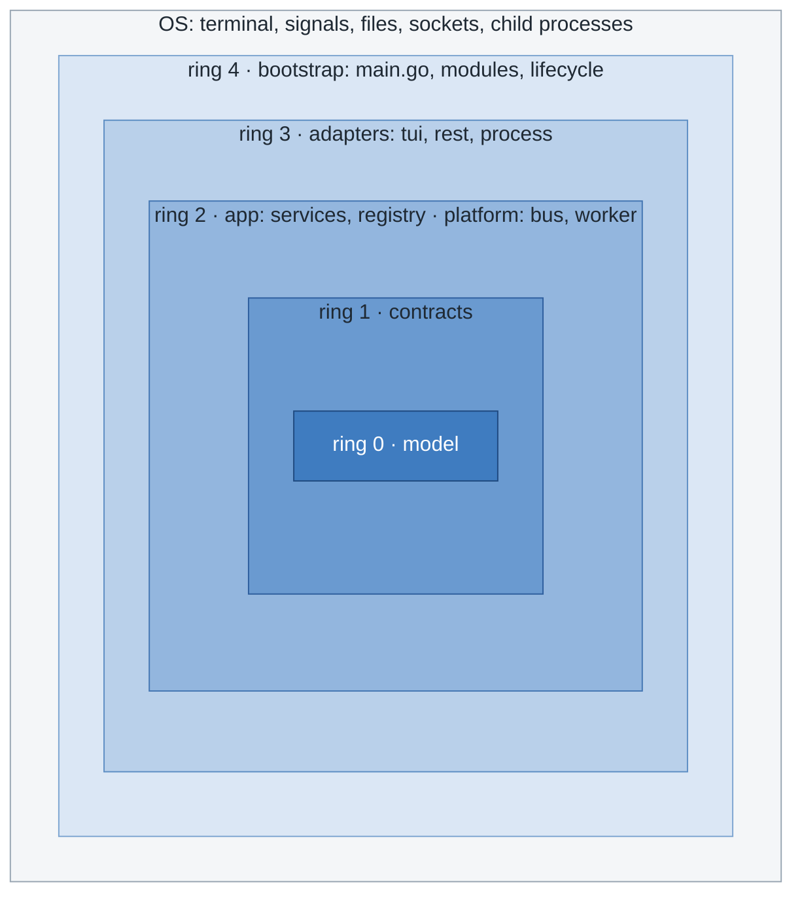

# Architecture

Every run of fuku executes one command, and every command gets its own Fx container and its own bus.

The packages sit in rings. The inner rings hold values and rules, while the outer rings do the IO and wire everything together.
An inner ring never knows about an outer one. When something happens, the package that did it publishes an event on the bus,
and every package that cares reacts to it. Every feature has the same shape: one core package with the rules, and adapters around it for the IO.

This file is the map. It shows the rings, tree, commands, features and bus messages.
The coding rules are in `CLAUDE.md`. The details of a package are in its README.

## Rings

The packages form five rings, numbered from the inside. A ring may import the rings inside it, but never the ones outside.
The innermost ring holds plain values and changes least. The outermost ring wires everything together and runs the command.
The OS sits outside all of them.

| Ring | Path                                | Holds                                                                       |
| ---- | ----------------------------------- | --------------------------------------------------------------------------- |
| 0    | `internal/model`                    | plain values: `Project`, `Service`, `Tier`, `Snapshot`, `Report`            |
| 1    | `internal/contracts`                | bus messages, `Publisher`, `Subscriber`, `Run`/`Loop`, `Process`, errors    |
| 2    | `internal/app/*`                    | the rules; one core package per feature                                     |
| 2    | `internal/platform/*`               | bus, log handler, worker pool, build info                                   |
| 3    | `internal/adapters/*`               | IO: terminal, HTTP, sockets, files, OS, observers                           |
| 4    | `internal/bootstrap`, `cmd/main.go` | one composition per command; the application lifetime                       |

`app` and `platform` share ring 2 but never import each other. `depguard` in `.golangci.yaml` enforces the import rule.


```mermaid
flowchart TB
    subgraph OS["OS: terminal, signals, files, sockets, child processes"]
        subgraph R4["ring 4 · bootstrap: main.go, modules, lifecycle"]
            subgraph R3["ring 3 · adapters: tui, rest, process"]
                subgraph R2["ring 2 · app: services, registry · platform: bus, worker"]
                    subgraph R1["ring 1 · contracts"]
                        R0["ring 0 · model"]
                    end
                end
            end
        end
    end
    style OS fill:#f4f6f8,stroke:#9aa7b4,color:#1f2933
    style R4 fill:#dbe7f5,stroke:#7fa6d1,color:#1f2933
    style R3 fill:#b9d0ea,stroke:#5f8fc4,color:#1f2933
    style R2 fill:#93b6de,stroke:#4577b3,color:#1f2933
    style R1 fill:#6a9ad0,stroke:#2f5f9e,color:#1f2933
    style R0 fill:#3f7cc0,stroke:#1f4a80,color:#ffffff
```

Traffic crosses the rings in three ways:

- **A call goes in and comes back.** When the user presses `r` in the TUI, `tui` calls `services.Control.Restart(id)`.
  `Control` asks its `Guard` whether the restart is allowed, publishes `CommandRestartService` and returns an `Admission`.
  The view uses the answer to start its loader
- **The core reaches out through an interface it owns.** `services.Runtime` starts a child by calling `Launcher.Start`.
  `Launcher` is an interface declared in ring 2, `adapters/process` implements it in ring 3, and `bootstrap/modules` binds the two.
  This is where fuku differs from OS rings: a kernel never calls user code, but the core does, through an interface it declares
- **An event goes in and comes out somewhere else.** `Runtime` publishes `ServiceStarting` and moves on.
  The bus carries the event to `registry`, which applies it and publishes `SnapshotChanged`. `tui.Bridge` forwards that to the view,
  and the terminal repaints. The publisher knows none of them

Ring 4 runs once per invocation. The shell starts `cmd/main.go`, which calls `bootstrap.Run`.
`bootstrap.Run` parses the command, loads the config when the command needs it and picks one composition.
The composition builds the container, and `lifecycle.Coordinator` starts the guard, telemetry, consumers, producers and command, in that order.
Then ring 4 waits for the command to finish and hands the exit code to `os.Exit`. No request ever passes through it.

## The tree

```
cmd/main.go                    calls bootstrap.Run

internal/bootstrap
  bootstrap.go                 Run: parse the command, load the config, pick a composition, run it
  modules                      one file per command; base.go and runtime.go hold the shared parts
  lifecycle                    participants, coordinator, arbiter, exit codes

internal/adapters
  cli                          cobra parsing; every command without the TUI; bare log lines; the JSON report
  tui                          the Bubble Tea program, the bus bridge, the services view, styled log lines and report
  rest                         the HTTP API
  process                      launches, tracks and stops child processes
  readiness                    http, tcp and log probes
  watch                        watches the files of a running service
  resources                    samples CPU and memory
  logsocket                    the project socket: server and client
  config                       loads fuku.yaml, builds model.Project
  envfiles                     reads one .env file
  diagnostics                  observes files, tools, sockets and ports for doctor
  github                       looks up the latest release
  instance                     identity, socket path, single-instance guard
  eventlog                     writes every event to the debug log and log clients
  telemetry                    Sentry: client, metrics, traces
  output                       the application log writer
  terminal                     theme, styles, layout

internal/app
  services                     the run, admission, retry, shutdown
  profiles                     profile name → ordered tiers
  registry                     the read model: events → Snapshot
  logs                         the log hub and `fuku logs` session
  environment                  the .env files of a service, merged
  doctor                       the checks and report
  updater                      the release check

internal/platform              bus, logging, worker, buildinfo
internal/contracts             one message or protocol type per file
internal/model                 plain values
```

## Commands

`bootstrap.Run` loads `fuku.yaml` for `run`, `stop` and `logs`. An invalid config ends them before any container exists.
`doctor` gets the `model.Config` with the error inside and reports on it. The other commands load nothing.

| Command    | Composition           | Command participant                        |
|------------|-----------------------|--------------------------------------------|
| `run`      | `modules/run.go`      | `tui.Program`, or `cli.Run` with `--no-ui` |
| `stop`     | `modules/stop.go`     | `cli.Stop`                                 |
| `logs`     | `modules/logs.go`     | `cli.Logs`                                 |
| `doctor`   | `modules/doctor.go`   | `cli.Doctor`                               |
| `init`     | `modules/init.go`     | `cli.Init`                                 |
| `help`     | `modules/help.go`     | `cli.Help`                                 |
| `version`  | `modules/version.go`  | `cli.Version`                              |

A composition gives the coordinator ordered lists of participants. A `Consumer` has `Subscribe` and `Drain`.
A `Producer` has `Start` and `Stop`. The one `Command` has `Run`. Start order: guard, telemetry, consumers, producers, command.
Stop is the reverse. Telemetry is a coordinator stage, not a participant. It stops after the command is joined, just before the bus closes.
`lifecycle.Arbiter` records the first exit cause and derives the exit code.
The blocks a composition stacks are in [`internal/bootstrap/modules/README.md`](internal/bootstrap/modules/README.md).
The lifetime is in [`internal/bootstrap/lifecycle/README.md`](internal/bootstrap/lifecycle/README.md).

## Features

Every feature has one core package. "Wired in" names the file and block in `internal/bootstrap/modules` that binds its adapters.

### Services

Runs a profile. Admits start, stop and restart from every frontend.

- core: `app/services` (`Runtime` runs, `Control` admits, `Guard` holds the phase and tokens, `Cleaner` cleans up for `stop`), `app/profiles`
- adapters: `process` launches and tracks, `readiness` probes, `watch` reports file changes
- frontends: the `s`, `r` and `ctrl+r` keys in `tui`; `POST /api/v1/services/{id}/{start,stop,restart}` in `rest`; `Run` and `Stop` in `cli` for `--no-ui` and `stop`
- bus: consumes the four commands and `WatchTriggered`; publishes the phase, tier and service events
- wired in `runtime.go`, blocks `processes` and `profile`; `Control` in `run.go` (`view`, `api`); `Cleaner` in `stop.go`
- details: [`internal/app/services/README.md`](internal/app/services/README.md)

### Registry

The read model. Every frontend reads the same `Snapshot` in place, under the store's read lock. Nothing copies it.

- core: `app/registry` (`Store`: `Read`, `WaitResolved`)
- adapters: `resources` collects the live PIDs inside `Read` and samples them outside it
- frontends: `tui` handles each message and renders each frame inside `Read`, and calls `Control` from a command after it; `rest` serializes inside one `Read` per request; `logsocket` reads the profile and the service names
- bus: consumes the lifecycle, watch, API and sample events; publishes `SnapshotChanged`
- wired in `runtime.go`, block `runtime`; `run.go` (`view`) for the TUI, (`api`) for the REST API
- details: [`internal/app/registry/README.md`](internal/app/registry/README.md)

### Logs

Carries child output to the application log, socket clients and `fuku logs`. Raw lines never go on the bus.

- core: `app/logs` (`Hub` keeps history and fans out, `Session` runs `fuku logs`)
- adapters: `process` writes each line to the hub; `logsocket` serves the hub and connects to it; `output` and `terminal` write and format the application log
- frontends: `LogView` in `cli` prints bare lines; `LogView` in `tui` prints the banner and styled lines
- wired in `runtime.go`, block `configured` (the hub); `logs.go` (client, session, view)
- details: [`internal/app/logs/README.md`](internal/app/logs/README.md), [`internal/adapters/logsocket/README.md`](internal/adapters/logsocket/README.md)

### Profiles

Turns a profile name into ordered tiers.

- core: `app/profiles` (`Resolver`)
- adapters: `config` loads the YAML and builds `model.Project`
- used by: `services` through `ProfileResolver`; `doctor` through `Profiles`
- wired in `runtime.go`, block `processes`, and in `doctor.go`

### Environment

Shows the merged `.env` values of a service in the TUI aside. Nothing injects them into the child.

- core: `app/environment` (`Store`)
- adapters: `envfiles` reads one file from a safe path
- frontends: the environment tab of the aside in `tui`
- bus: consumes `ProfileResolved` and `ServiceStarting` to reload
- wired in `run.go`, block `view`. A headless run has no store

### Doctor

Checks the environment, config, services, topology and running instance. Renders a report.

- core: `app/doctor` (`Runner`)
- adapters: `diagnostics` observes; `config` gives the `model.Config`; `instance` gives the fingerprint
- frontends: `Doctor` in `cli` runs it and renders JSON; `tui` renders the styled report and summary
- wired in `doctor.go`
- details: [`internal/app/doctor/README.md`](internal/app/doctor/README.md)

### Updater

Tells the user that a newer release exists.

- core: `app/updater` (`Checker`, runs once on `Start`)
- adapters: `github` fetches the release and keeps a cache
- frontends: `tui` shows the version in the header
- bus: publishes `UpdateAvailable`
- wired in `runtime.go`, block `runtime`
- details: [`internal/app/updater/README.md`](internal/app/updater/README.md)

## Cross-cutting

These run next to every feature. They decide nothing about services.

| Package     | Does                                                                                             |
| ----------- | ------------------------------------------------------------------------------------------------ |
| `eventlog`  | writes every event to the debug log and log clients as `fuku` lines                              |
| `telemetry` | one metric per event, one trace per `run`; off without a DSN or with `FUKU_TELEMETRY_DISABLED`   |
| `instance`  | refuses a second `run` of the same project; gives `run`, `logs` and `doctor` one socket path     |
| `cli`       | parses the command line; publishes `CommandStarted`; every command that runs without the TUI     |
| `output`    | writes the application log; off while the TUI owns the terminal                                  |
| `terminal`  | theme, every style, layout helpers                                                               |

## Bus messages

A critical message needs a free slot in every required subscription. Otherwise the publish fails and the run ends with exit 1.
A message that is not critical is dropped where a queue is full.

| Message                                                                  | Critical | Subscribers                                                    |
| ------------------------------------------------------------------------ | -------- | -------------------------------------------------------------- |
| the four service commands, `WatchTriggered`                              | yes      | `services`                                                     |
| `ProfileResolved`, `PhaseChanged`, tier and service events               | yes      | `registry`; `watch` (subset); `environment` (optional, subset) |
| `APIStarted`, `APIStopped`                                               | yes      | `registry`                                                     |
| `PreflightStarted`, `PreflightComplete`, `SignalReceived`                | yes      | `tui` (optional)                                               |
| `PreflightKilled`, `UpdateAvailable`, `SnapshotChanged`                  | no       | `tui` (optional)                                               |
| `WatchStarted`, `WatchStopped`, `ServiceResourcesSampled`                | no       | `registry`                                                     |
| `CommandStarted`, `ReadinessComplete`, `ResourceSampled`, `APIRequested` | no       | –                                                              |

A subscriber is required unless marked optional. `eventlog` holds an optional, unfiltered subscription and sees every message.
`telemetry` holds two more when it is enabled.
`contracts.MessageType.Critical()` is the exact table. The message rules are in [`internal/contracts/README.md`](internal/contracts/README.md).
Details are in [`internal/platform/bus/README.md`](internal/platform/bus/README.md).
