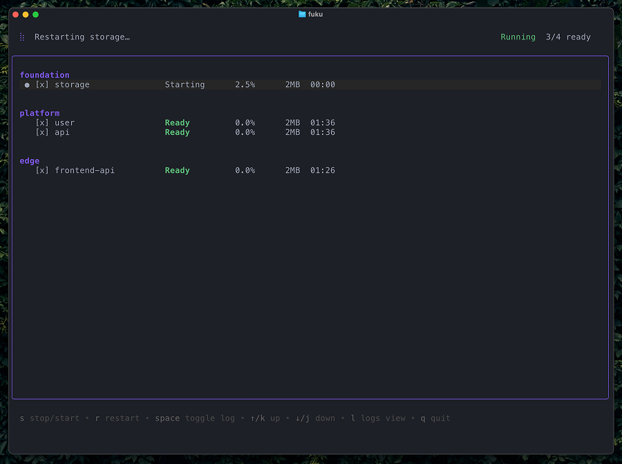

# fuku

**fuku** is a lightweight CLI orchestrator for running and managing multiple local services in development environments.



## Features

- **Interactive TUI** - Real-time service monitoring with status, CPU, memory, and uptime
- **Service Orchestration** - Tier-based startup with dependency resolution
- **Service Control** - Start, stop, and restart services interactively
- **Graceful Shutdown** - SIGTERM with timeout before force kill
- **Profile Support** - Group services for batch operations
- **Readiness Checks** - HTTP and log-pattern based detection
- **Log Streaming** - Filter and view service logs in real-time

## Installation

```bash
git clone git@github.com:tab/fuku.git
cd fuku
go build -o fuku ./cmd
```

## Quick Start

```bash
# Run with TUI (default)
fuku --run=default

# Run without TUI
fuku --run=default --no-ui

# Show help
fuku help

# Show version
fuku version
```

### TUI Controls (services)

```
↑/↓ or k/j       Navigate services
pgup/pgdn        Scroll viewport
home/end         Jump to start/end
r                Restart selected service
s                Stop/start selected service
space            Toggle logs for selected service
ctrl+a           Toggle all logs
tab              Switch to logs view
q                Quit
```

### TUI Controls (logs)

```
↑/↓ or k/j       Scroll logs
pgup/pgdn        Scroll viewport
home/end         Jump to start/end
a                Toggle autoscroll
ctrl+r           Clear logs
tab              Switch back to services view
q                Quit
```

## Configuration

Create `fuku.yaml` in your project root:

```yaml
version: 1

services:
  postgres:
    dir: ./infrastructure/postgres
    tier: foundation
    readiness:
      type: log
      pattern: "database system is ready"
      timeout: 30s

  api:
    dir: ./api
    tier: platform
    readiness:
      type: http
      url: http://localhost:8080/health
      timeout: 30s

  web:
    dir: ./frontend
    tier: edge
    profiles: [default]

defaults:
  profiles: [default]

profiles:
  default: "*"                    # All services
  backend: [postgres, api]        # Backend services only
  minimal: [api, postgres]        # Minimal set

logging:
  format: console
  level: info
```

### Tiers

Services are organized into tiers for startup ordering:
- **foundation** - Base infrastructure (databases, message queues)
- **platform** - Business logic services
- **edge** - Client-facing services

Services start tier-by-tier: foundation → platform → edge.

### Readiness Checks

- **log** - Wait for pattern in service output
- **http** - Wait for HTTP endpoint to respond

### Service Requirements

Each service directory must have a Makefile with a `run` target:

```makefile
run:
	npm start
```

## Architecture

See [ARCHITECTURE.md](ARCHITECTURE.md) for detailed architectural patterns and design decisions.

## Development

### Building

```bash
# Build binary
go build -o fuku ./cmd

# Run tests
make test

# Run linter
make lint

# Run vet
make vet

# Format code
go fmt ./...

# Full validation
go fmt ./... && make lint && make vet && make test
```

## About the Name

The name fuku (福) means "good fortune" in Japanese. Inspired by jazz pianist Ryo Fukui, reflecting the tool's focus on orchestration and harmony.

## License

Distributed under the MIT License. See `LICENSE` for more information.
