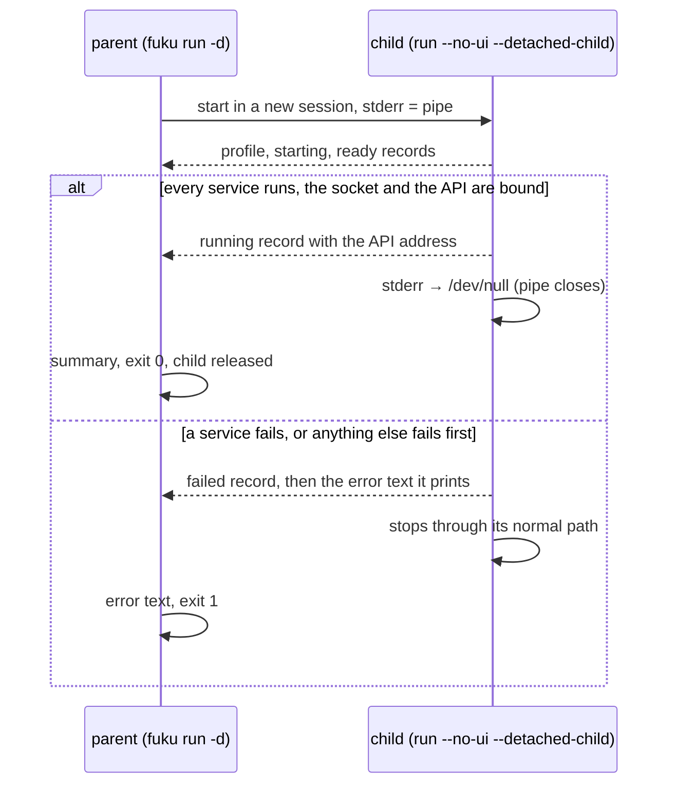

# adapters/detach

The detached run: `fuku run -d` and the stop of a running instance.
Go cannot fork, so a detached run is two processes of the same binary.

## How it works

- `Launcher` starts the child with the parsed profile and config path. The child inherits the working directory `ChangeToConfigDir` set
- `Command` is the parent. It reads the pipe line by line, of any length. A JSON line is a `Record`. Any other line is text the child printed, such as a guard refusal or a panic.
  Success is a running record with no text after it. Any other end of the pipe terminates and reaps the child
- `Progress` is the child's consumer. It turns bus events into records and fails the run on a `ServiceFailed` or an unexpected `ServiceStopped` before the run phase.
  Success waits for `logsocket.Server.Bound` and `rest.Server.Address`, so the summary names the API and `fuku logs` and `fuku stop` always find the instance.
  A failed release fails the run
- `Stderr.Release` points the child's standard error at `/dev/null`. That closes the pipe, so the parent sees EOF after the running record
- `Plain` writes one line per record for a pipe or `--no-ui`. The terminal view is `tui.Startup`
- `Stopper` reads the instance PID from the socket status, sends `SIGTERM`, waits for the exit and sends `SIGKILL` after the stop timeout.
  A zombie counts as exited, since its parent may reap it late

`Command` traps `SIGINT` and `SIGTERM` itself, because the coordinator cancels its context only after the drain.
A signal, or a context that ended, makes it send `SIGTERM` to the child, drain the pipe and wait. It never releases a child after either. The exit is 130.
Once the pipe closes after a running record, the command ignores those signals before it releases the child, so a released child never exits 130.

## Changing it

- the records are internal to one binary. Change them freely, but keep every record a single line that starts with `{`
- the child must never write to its standard error after `Release`. Writes then go to `/dev/null`
- the child ignores `SIGPIPE`, so a parent that died turns a record write into an error instead of killing the child
