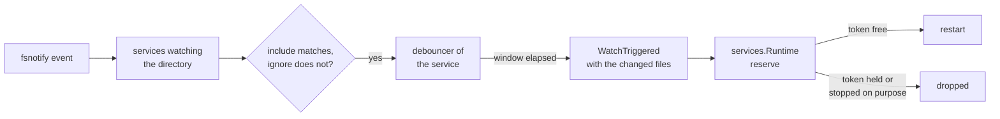

# adapters/watch

File watching for services with `watch:`. It turns file system events into one `WatchTriggered` per burst.
What happens next is decided in `app/services`.

## How it works

The watcher is a consumer and a producer of the run composition.
`Start` opens the one fsnotify watcher. `Stop` closes it and waits for its event goroutine. The constructor holds no OS resource.

- `ServiceReady` starts watching the service. `ServiceStopped` stops it. `ServiceFailed` does not: the next change may fix it
- a stop cancels the pending batch before it returns. A change already in flight is refused by `reserve` in `app/services`
- a service without `watch:` is ignored
- the service directory and every `shared` path are walked. Every directory is registered with fsnotify, except those an `ignore` pattern matches
- the walk runs outside the lock. Only storing the target and its registry entries takes it. A stop during the walk ends it
- a directory created at runtime is registered too
- one fsnotify watcher serves every service. A directory two services watch is registered once

An event:

- write, create, remove and rename count. Other events are ignored
- a path is matched relative to the service directory or the shared path. A `**/` pattern also matches at the root
- the window is `watch.debounce`, default 500ms. Every change restarts the timer. The batch is the set of changed files
- `WatchTriggered` is critical. A rejected publish is logged

## Changing it

- the restart decision stays in `app/services`. The watcher never knows whether a service is busy
- keep one fsnotify watcher and the shared registry. A watcher per service would register a shared directory twice
- keep the walk outside `w.mu`. A large tree under the lock blocks every other service's events
- a new event kind is a change to `isRelevantEvent`. A new pattern rule is a change to `matcher`
