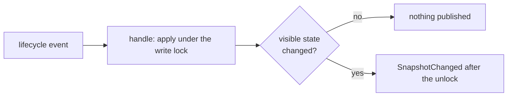

# app/registry

The runtime read model. The store keeps one `model.Snapshot` and projects the lifecycle events into it.
The TUI, the REST API, the log socket server and the resource sampler read it. None of them keeps a copy.

## The snapshot

- `model.Snapshot` holds the phase, the profile, the start time, the API state, the tiers and the services
- a tier and the `Services` map point at the same `*model.Service`. The order comes from `Tiers`
- `Counts()` tallies the statuses on demand
- one `sync.RWMutex` guards the snapshot. Nothing is copied on read

## Projection

- the subscription is required and filtered to the types in `projected`
- `handle` runs each message through `apply` under the write lock. An `apply<Event>` handler in `store.go` changes the snapshot in place
- `SnapshotChanged` carries nothing. It is not critical. A slow reader loses a notification, never a fact

The rules worth knowing:

- `ProfileResolved` allocates the store's own tiers and services from the payload, once. No payload aliases registry state
- `ServiceStarting` records the PID and the attempt time. It clears the error and the usage
- `ServiceFailed` keeps the error text and drops the PID
- a resource sample applies only where its PID still matches the service

## Reads

- `Read(fn)` runs `fn` under the read lock
- `WaitResolved(ctx)` blocks until the first `ProfileResolved`. The log socket server waits on it before it binds

Each consumer reads what it needs inside `Read` and does the slow part outside:

- REST serializes inside `Read` and writes the response after it
- the sampler collects the live PIDs inside `Read` and samples them after it
- the log socket server reads the profile and the service names inside `Read`
- the TUI handles each message and renders each frame inside `Read`. It reads again once a second to recover a dropped notification

## Changing it

- the bus loop is `handle`'s only caller. A new caller publishes the event and lets the projection apply it
- a callback never calls `Read` or `handle`. The lock is not reentrant
- nothing outside `handle` changes the snapshot
- a stored service is a shallow copy. It shares the `Readiness`, `Watch` and `Environment` pointers and the `LogOutput` slice
  with the project and the payload. Nothing writes through them
- a callback reads through the snapshot only while it runs. It does no IO
- a callback never calls `Control`, publishes or blocks
- a new projected type is a row in `projected` and one `apply` handler. The handler reports whether the visible state changed.
  Returning true for an unchanged state publishes a useless notification
- the store is the only projection. A frontend that needs a derived fact computes it inside `Read`
- admission never reads the snapshot. `app/services` keeps its own facts
