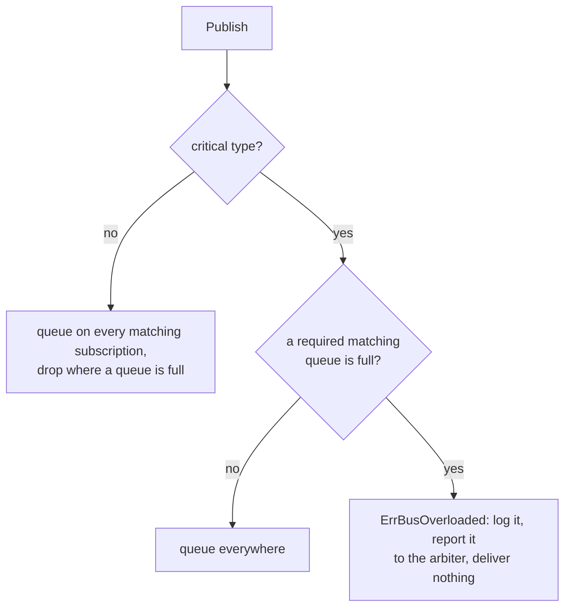

# platform/bus

The in-process message transport. Every event and command travels on it.

The bus moves `contracts.Message` values from a publisher to named subscriptions. It does not know what they mean.
The types, the payloads and the critical flag live in `internal/contracts`.

A publisher never knows its consumers. A consumer never slows a publisher down.

## Delivery

- one lock serializes every publish
- every subscription sees the messages in publication order
- a send never waits. A handler may publish, even to its own queue

Criticality belongs to the message type. See `contracts.MessageType.Critical()`.
A critical publish fails when a required matching queue is full, whatever filled it. An optional subscription is best effort.
Drops are counted per subscription and type. One warning per type is logged when the subscription ends.

## Using it

No application package imports this package. A package takes `contracts.Publisher` or `contracts.Subscriber`.
`bootstrap/modules/base.go` binds `*bus.Bus` to both.

A subscription has a `Name`, a list of `Types` (nil means all) and a `Required` flag. It ends with its context.
Drive it with `contracts.Run`. Its `Loop.Drain` is the shutdown barrier.

A critical publish can fail in two ways:

- `ErrBusOverloaded`: a required consumer is `QueueDepth` (1024) messages behind. The bus has already reported it to the arbiter.
  A publisher never reports it again
- `ErrBusClosed`: the container is stopping

A non-critical publish never fails.

`Close` runs at the end of the coordinator's `Stop`, after the consumers drained. This package registers no Fx hook.
A message still queued is received before the channel reports closed.

## Changing it

- keep the check and the send under one lock. A reservation outside it lets two publishers race for one slot
- a new delivery rule goes into `admit`
- a new message type is a row in the `contracts` criticality table. Never a bus flag
