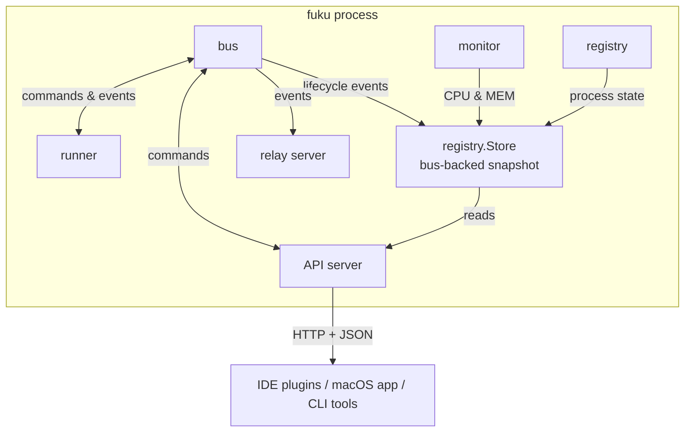
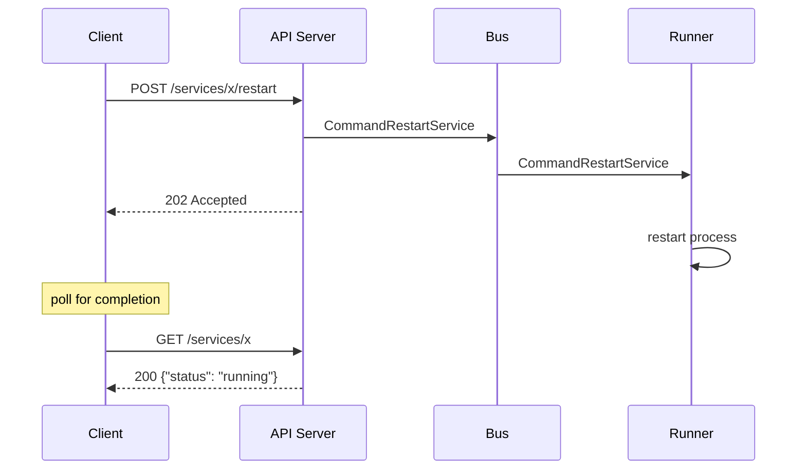

# API

- Status: implemented
- Branch: `feat/api`
- Depends on: `master` at `c97a24f`

## Summary

HTTP API for external clients (IDE plugins, macOS app, CLI tools) to observe
and control services managed by a running fuku instance. The API server is
embedded in the fuku process, not a sidecar and not a separate binary.

Disabled by default. Enabled by adding an `api` section to `fuku.yaml` or
`fuku.override.yaml`.

The API is available only while a `fuku run ...` instance is active.

Read endpoints are synchronous. Action endpoints are asynchronous: they return
`202 Accepted` after the command has been validated and published to the
runtime bus. Clients poll `GET /api/v1/services/:id` to observe the resulting
state transition.

## Requirements

### Functional Requirements

- FR-1: List services in the active profile with name, tier, status, PID, CPU,
  memory, and uptime
- FR-2: Get a single service in the active profile with the same detail
- FR-3: Start a `stopped` or `failed` service
- FR-4: Stop a `running` service
- FR-5: Restart a `running` service
- FR-6: Return fuku instance status with profile, phase, version, uptime, and
  service counts
- FR-7: Reject requests without a valid bearer token with 401
- FR-8: Return 404 for unknown services or services outside the active profile
- FR-9: Return 409 for invalid state transitions or when the instance is not
  accepting actions
- FR-10: Zero runtime fields (PID, CPU, memory, uptime) for non-running services

### Non-Functional Requirements

- **Performance:** response time < 50ms for read endpoints, < 25ms for action
  acceptance endpoints
- **Security:**
  - Bearer token authentication required on all endpoints (case-insensitive
    scheme matching per RFC 7235)
  - Token configured in `fuku.yaml`, never logged, never returned in responses
  - Loopback-only in v1. Non-loopback bind addresses are rejected by config
    validation
  - Port must be in valid range (1-65535)
  - CORS enabled with wildcard origin for browser-based tools (token auth is
    the security boundary)
- **Reliability:** API server failure must not take down the fuku process or
  managed services
- **Compatibility:** JSON responses, standard HTTP semantics, no custom headers
  beyond `Authorization`
- **Determinism:** `GET /services` returns a stable order: tier order first,
  then service name inside each tier
- **Concurrency:** API-triggered start/restart commands go through the worker
  pool, respecting the configured `concurrency.workers` limit

### Out of Scope

- SSE / WebSocket streaming
- Log streaming through the API
- Service configuration changes at runtime
- Multi-instance coordination
- HTTPS / TLS
- Non-loopback listeners
- Per-request operation resources or job tracking

## Architecture & Design

### High-Level Design



**Read path:** handlers read from `registry.Store`. The store subscribes to bus
lifecycle events and maintains per-service snapshots with status, PID,
timestamps, and last failure. It also samples CPU and memory on a fixed
interval and normalizes memory to bytes for the API contract. Timestamps are
recorded from the bus message publish time, not the store's dequeue time.

**Write path:** handlers validate the current runtime state using `Status`
helper methods (`IsStartable`, `IsStoppable`), publish `CommandStartService`,
`CommandStopService`, or `CommandRestartService` to the bus, and return
`202 Accepted` immediately. The runner executes commands through the worker
pool, the same way it handles TUI and watcher-triggered actions.

**Lifecycle:** constructors are provided via FX, but the HTTP server is started
and stopped by `runner.Run`, the same pattern the relay server already uses.
The API starts after the profile is resolved and the bus subscription is
established, ensuring early requests see the correct profile and service list.
This keeps the API scoped to the active `run` instance and avoids binding
sockets for short-lived commands such as `stop` or `logs`.



### API

All endpoints require `Authorization: Bearer <token>` header.

Base path: `/api/v1`

`GET /services` and `GET /services/:id` operate on services in the active
profile of the running instance only.

`status` values (defined as `registry.Status` type):

- `starting`
- `running`
- `stopping`
- `restarting`
- `stopped`
- `failed`

`Status` type provides helper methods: `IsRunning()`, `IsStartable()`,
`IsStoppable()`, `IsRestartable()`.

`memory` is RSS in bytes. `uptime` is seconds since the current process started.
For non-running services, PID, CPU, memory, and uptime are `0`.

Action endpoints are accepted only when the instance phase is `running`. During
startup or shutdown they return `409`.

#### `GET /api/v1/status`

Returns fuku instance information. Uptime starts from the startup phase (not
from when all services are ready).

```
Response 200:
{
  "version": "0.18.0",
  "profile": "default",
  "phase": "running",
  "uptime": 3600,
  "services": {
    "total": 8,
    "starting": 0,
    "running": 6,
    "stopping": 0,
    "restarting": 0,
    "stopped": 1,
    "failed": 1
  }
}
```

#### `GET /api/v1/services`

Returns all services in the active profile, ordered by tier and then service
name.

```
Response 200:
{
  "services": [
    {
      "id": "550e8400-e29b-41d4-a716-446655440000",
      "name": "api-gateway",
      "tier": "foundation",
      "status": "running",
      "watching": true,
      "pid": 12345,
      "cpu": 2.4,
      "memory": 67108864,
      "uptime": 3600
    },
    {
      "id": "6ba7b810-9dad-11d1-80b4-00c04fd430c8",
      "name": "web-app",
      "tier": "application",
      "status": "stopped",
      "watching": false,
      "pid": 0,
      "cpu": 0,
      "memory": 0,
      "uptime": 0
    }
  ]
}
```

#### `GET /api/v1/services/:id`

Returns a single service by UUID.

```
Response 200:
{
  "id": "550e8400-e29b-41d4-a716-446655440000",
  "name": "api-gateway",
  "tier": "foundation",
  "status": "running",
  "watching": true,
  "error": "",
  "pid": 12345,
  "cpu": 2.4,
  "memory": 67108864,
  "uptime": 3600
}

Response 404:
{
  "error": "service not found"
}
```

#### `POST /api/v1/services/:id/start`

Starts a `stopped` or `failed` service. Asynchronous. Responds once the command
has been accepted and published. Clients poll `GET /api/v1/services/:id`.

The service must pass `Status.IsStartable()` (stopped or failed). Services in
any other state (starting, running, stopping, restarting) are rejected with 409.

```
Response 202:
{
  "id": "550e8400-e29b-41d4-a716-446655440000",
  "name": "api-gateway",
  "action": "start",
  "status": "starting"
}

Response 404:
{
  "error": "service not found"
}

Response 409:
{
  "error": "service cannot be started"
}
```

#### `POST /api/v1/services/:id/stop`

Stops a `running` service. Asynchronous. Responds once the command has been
accepted and published. Clients poll `GET /api/v1/services/:id`.

The service must pass `Status.IsStoppable()` (running only).

```
Response 202:
{
  "id": "550e8400-e29b-41d4-a716-446655440000",
  "name": "api-gateway",
  "action": "stop",
  "status": "stopping"
}

Response 404:
{
  "error": "service not found"
}

Response 409:
{
  "error": "service is not running"
}
```

#### `POST /api/v1/services/:id/restart`

Restarts a `running` service. Asynchronous. Responds once the command has been
accepted and published. Clients poll `GET /api/v1/services/:id`.

The service must pass `Status.IsStoppable()` (running only).

```
Response 202:
{
  "id": "550e8400-e29b-41d4-a716-446655440000",
  "name": "api-gateway",
  "action": "restart",
  "status": "restarting"
}

Response 404:
{
  "error": "service not found"
}

Response 409:
{
  "error": "service is not running"
}
```

#### Common Error Responses

```
Response 401:
{
  "error": "unauthorized"
}

Response 409:
{
  "error": "instance is not accepting actions"
}
```

### Configuration

```yaml
# fuku.yaml or fuku.override.yaml
api:
  listen: "127.0.0.1:9876"
  auth:
    token: "my-dev-token"
```

| Field            | Description                                          | Required  |
|------------------|------------------------------------------------------|-----------|
| `api.listen`     | TCP address to bind, must be loopback, port 1-65535  | yes       |
| `api.auth.token` | Bearer token for authentication                      | yes       |

When the `api` section is absent, the API server is not started. When present,
both `listen` and `auth.token` are required, and `listen` must be loopback-only
with a valid port or fuku exits with a config error.

### Implementation Details

**Packages:**

- `internal/app/api/` - HTTP server, handlers, middleware, serializers
- `internal/app/registry/` - Runtime state store (`store.go`), service status
  type and helpers, process registry

**Files:**

- `internal/app/api/server.go` - Server interface, HTTP server lifecycle, noOp
  implementation for disabled API
- `internal/app/api/handler.go` - Request handlers and JSON serializers
- `internal/app/api/middleware.go` - CORS and auth middleware
- `internal/app/api/module.go` - FX module
- `internal/app/registry/store.go` - Bus-backed runtime snapshot store with
  `Status` type, status constants, and `ServiceSnapshot`
- `internal/app/registry/store_mock.go` - Generated mock for Store interface

**FX wiring:** FX provides constructors only. The runner owns API server
start/stop via `startAPI()`/`stopAPI()` methods and passes the active profile
context. The `EventAPIStarted`/`EventAPIStopped` bus events are published only
when the API successfully binds and after it fully stops, respectively.

**Runtime state:** The store subscribes to bus events and keeps:

- instance phase, profile, and process start time (from `msg.Timestamp`)
- per-service status, tier, PID, and start time (from `msg.Timestamp`)
- last failed error for status transitions
- sampled CPU percentage and RSS memory bytes (with PID recheck to prevent
  stale stats after restarts)

**Service commands:** API start/stop/restart handlers validate state using
`Status.IsStartable()`, `Status.IsStoppable()`, then publish dedicated bus
commands. The runner processes these through the worker pool to respect
`concurrency.workers`.

**TUI integration:** The TUI bottom bar shows API status when enabled:
`◉ 127.0.0.1:9876` with sky blue dot (connected) or grey dot (disconnected),
driven by `EventAPIStarted`/`EventAPIStopped` bus events.

## Test

- Auth middleware rejects missing token with 401
- Auth middleware rejects invalid token with 401
- Auth middleware accepts valid token
- Auth middleware accepts case-insensitive Bearer prefix
- GET /status returns profile, phase, version, uptime, and service counts
- GET /services returns active-profile services with stable ordering
- GET /services returns zeroed runtime fields for non-running services
- GET /services/:id returns single service
- GET /services/:id returns 404 for unknown or inactive-profile service
- POST /services/:id/start publishes start command and returns 202
- POST /services/:id/start returns 409 when service is not `stopped` or `failed`
- POST /services/:id/stop publishes stop command and returns 202
- POST /services/:id/stop returns 409 when service is not `running`
- POST /services/:id/restart publishes restart command and returns 202
- POST /services/:id/restart returns 409 when service is not `running`
- POST action endpoints return 409 when instance phase is not `running`
- API server does not start when config is absent
- API server starts only during `run` when config is present
- Config validation rejects out-of-range ports (e.g., 99999, 0)
- Config validation rejects non-loopback addresses
- Runtime store tracks service lifecycle from bus events
- Runtime store clears startTime on service failure
- Runtime store samples CPU and memory with PID recheck
- Status.IsRunning/IsStartable/IsStoppable/IsRestartable cover all states
- Controller returns false when command is not published
- Resume guards against concurrent starts
- E2E: status, list, get, start, stop, restart, conflict, auth, counts, UUIDs

## OpenAPI

See [openapi.yaml](openapi.yaml)
